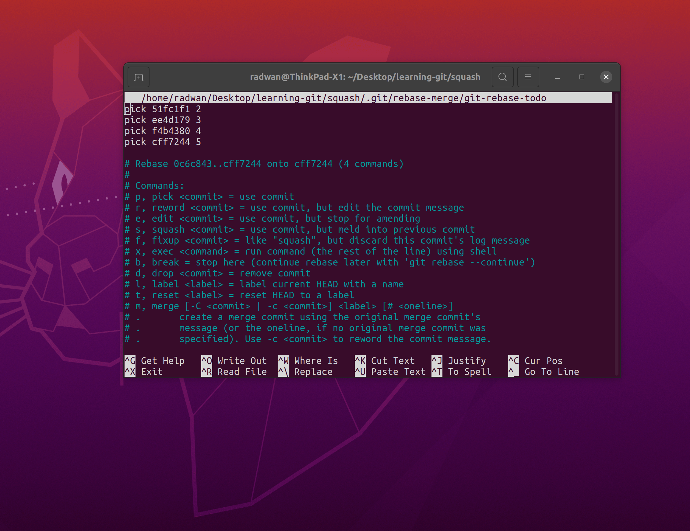
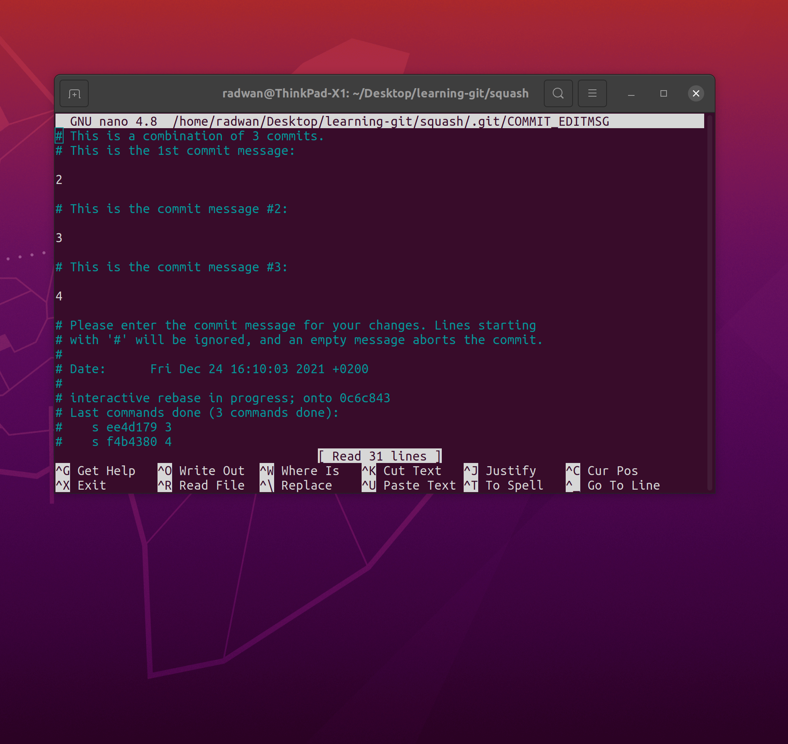

# Squash

- [Squash](#squash)
  * [Problem](#problem)
  * [Steps](#steps)
  * [Try it yourself](#try-it-yourself)

## Problem

Assume we have git repository with 5 commits with titles "1", "2", "3", "4", "5" and we want to combine commits with titles "2","3",4" into one commit with new name "combined commit" 

So we want to change our commit history from:

    ``` bash
    cff7244 (HEAD -> master) 5
    f4b4380 4
    ee4d179 3
    51fc1f1 2
    0c6c843 1
    ```

to:

    ``` bash
    cff7244 (HEAD -> master) 5
    ....... combined commit
    0c6c843 1
    ```
## Steps

1. Run the following command
   
    ```
    git rebase -i HEAD~N
    ```

    Where N is the number of commits from HEAD to earliest commit you want to change, in our example HEAD is pointing to commit with title "5" and earliest commit we want to change is the commit with title "2", so we have N = 4

    So in our example the command is 
    ```
    git rebase -i HEAD~4
    ```
2. You'll get the following window
	

3. To squash commit to previous one we replace "pick" keyword by "s"
	
	this will squash commits with title "3","4" with commit with title "2"


4. After closing the window you'll be asked to enter commit message for the squashed commits

	

	We'll write the commit title we want which is "combined commit"
	
5. Run the following command to make sure you have the commit history you wanted
    ``` bash
    git log --oneline
    ```
   
    ``` bash
    afed836 (HEAD -> master) 5
    2c97642 combined commit
    0c6c843 1
    ```


## Try it yourself

Copy [create.sh](./create.sh) to empty directory and run it using `./create.sh` , now you have git repository with commit history similar to what we had in the example. try to squash commits with titles "4", "5" into one commit.
